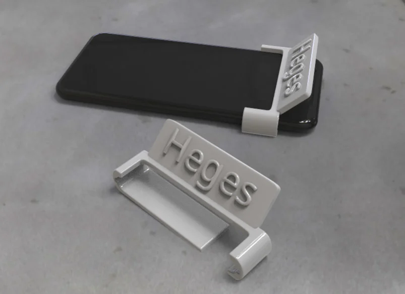

* You are making a 3D model of the iPhone 12 mini Face ID mount.
* You are using OpenSCAD to create the 3D model.
* You are using the iPhone 12 mini drawings from https://developer.apple.com/accessories/Accessory-Design-Guidelines.pdf
* You are using the iPhone 12 mini stl from https://www.thingiverse.com/thing:3254381
* You are using the Heges 3D Scanner to scan the iPhone 12 mini Face ID mount.
* Reference https://cdn.thingiverse.com/renders/27/82/81/a4/66/3f46c59fc04991e4ec0911ba080c9f60_display_large.jpg for what a mount should roughly look like. 
* Keep `.gitignore` updated.
* Periodically run `make` to build the STL files.
* After every change, run `make` to build the STL files.
* The make file should also make preview images of the STL files which you will view to make sure we're on the right track.